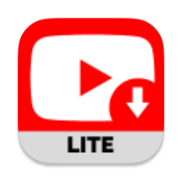

<p align="center">
  
</p>

<h1 align="center">YTMac</h1>

<p align="center">
  <strong>Free YouTube video downloader for macOS</strong><br>
  Beautiful native app. No ads. No tracking. Open source.
</p>

<p align="center">
  
  
  
  
</p>

---

## Screenshots

<p align="center">
  
</p>

<p align="center">
  
</p>

<p align="center">
  
</p>

---

## Features

- **Download videos** from YouTube and 1,000+ sites in MP4 (up to 720p)
- **Extract audio** as MP3 with one click
- **Real-time progress** with video thumbnails, title, channel, speed, and ETA
- **Batch downloads** — paste multiple URLs, downloads queue automatically
- **Download history** with Play and Reveal in Finder buttons
- **Auto-updating engine** — yt-dlp updates silently in the background
- **Collections** — Music and Videos auto-sorted by format
- **Dark mode** native macOS design
- **Zero setup** — just install and paste a URL

## Download

**[Download YTMac v1.0.0](https://github.com/tpjuic/YTMac/releases/latest)**

> **First launch:** macOS will block the app. Go to **System Settings → Privacy & Security** → scroll down and click **"Open Anyway"** next to the YTMac message.

## System Requirements

- macOS 14 (Sonoma) or later
- Internet connection
- ~100 MB disk space (app + download engine)

## How It Works

1. Paste a YouTube URL (or any supported site)
2. Choose quality (720p) and format (MP4 or MP3)
3. Click Download
4. Watch the progress — thumbnail, speed, ETA all shown live
5. Play or Reveal in Finder when complete

YTMac automatically downloads and manages [yt-dlp](https://github.com/yt-dlp/yt-dlp) and ffmpeg on first launch. No manual setup needed.

## Supported Sites

YouTube, Vimeo, Twitter/X, Reddit, Instagram, TikTok, Dailymotion, Twitch, SoundCloud, and [1,000+ more](https://github.com/yt-dlp/yt-dlp/blob/master/supportedsites.md) (1,752 extractors total).

## Building from Source

```bash
git clone https://github.com/tpjuic/YTMac.git
cd YTMac/YTMac
open YTMac.xcodeproj
# Build and Run (⌘R)
```

Requires Xcode 15+ and macOS 14+.

## Premium

Want 4K downloads and no rate limits? [Upgrade to Premium →](https://ytmac.app/premium)

Your purchase supports independent development.

## Privacy

YTMac runs entirely on your Mac. No telemetry, no analytics, no data collection. All downloads and history are stored locally.

## License

[MIT License](LICENSE) — free to use, modify, and distribute.

## Credits

Powered by [yt-dlp](https://github.com/yt-dlp/yt-dlp) and [ffmpeg](https://ffmpeg.org/).

---

<p align="center">
  Built with ❤️ for macOS
</p>
